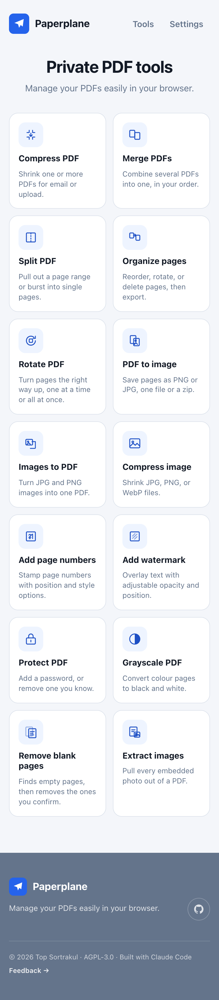

# PaperPal

Private PDF tools that run **entirely in your browser**: compress, scan pages
with your camera, translate a scan, have one read aloud, merge, split, organize,
rotate, convert to and from images, add page numbers or watermarks,
password-protect or unlock, grayscale, strip blank pages, pull out embedded
images, and shrink image files. No account, no server, and your files never
leave your device.

> **Files are processed on your device and never uploaded.** There is no backend,
> no analytics, and no external request that carries your file anywhere. You can
> open the network tab and check.

Live: **https://natchaponsor.github.io/pdf-tools/**

<p align="center">
  
</p>

## Why

Most "compress a PDF" websites upload your document to a server you don't
control. PaperPal does the whole job locally using WebAssembly builds of
mature PDF engines, so a confidential contract or a pile of payslips never
touches the network.

## Features

### The tools (17)

| Tool | What it does |
| --- | --- |
| **Compress PDF** | Shrink one or several PDFs at once (shared 50 MB budget). Three quality levels, first-page preview and before/after size per file, download individually or as a `.zip`. |
| **Translate a PDF** | OCR a scanned PDF on your device (English or Thai), read the recognised text, then hand it to your translator in one tap: the share sheet on a phone, Google Translate on the web. The text leaves the app only when you tap. You also get a searchable PDF. |
| **Read a PDF aloud** | OCR a scan, then have the browser's built-in speech engine read it: play / pause / scrub by paragraph, choose a voice and speed, follow along with the highlighted text. Works offline, no audio is sent anywhere. |
| **Scan documents** | Photograph pages with your phone camera. OpenCV finds each page's edges and perspective-corrects it to a flat rectangle (colour / greyscale / B&W). After each page: rescan, scan the next, or stop. Then reorder the pages in a grid and export one PDF. All on-device. |
| **Merge PDFs** | Combine several PDFs into one, in an order you set. |
| **Split PDF** | Pick pages from a thumbnail grid (tap to select, or All / None / Odd / Even / a range), then pull them out as one PDF or a `.zip` of single pages. |
| **Organize pages** | Drag page thumbnails to reorder, rotate, or delete, then export a new PDF. |
| **Rotate PDF** | Tap individual pages to turn them, or rotate the whole document left/right at once. |
| **PDF to image** | Render pages to PNG or JPG at 72/150/300 DPI: one page, or a `.zip`. |
| **Images to PDF** | Combine JPG/PNG images into one PDF (fit-to-image, A4, or Letter). |
| **Compress image** | Shrink JPG, PNG, or WebP files, several at a time. |
| **Add page numbers** | Position, style (`1`, `Page 1`, `1 / N`), size, and start number. |
| **Add watermark** | Diagonal or horizontal text with adjustable opacity and size. |
| **Protect PDF** | Add an open password (AES-256), optionally block editing/copying, or remove a password you know. |
| **Grayscale PDF** | Convert every colour page to black and white; text and vectors stay crisp. |
| **Remove blank pages** | Auto-flags empty-looking pages from a thumbnail scan; you review and adjust, then export. |
| **Extract images** | Pull every embedded raster out of a PDF. JPEGs keep their original bytes, everything else comes out as PNG. |

Every result screen lets you rename the file before saving (the extension is
fixed; a blank name falls back to the generated default).

### Compress PDF: how it works

| Level | Engine | Approach | Typical result\* |
| --- | --- | --- | --- |
| **Light** | MuPDF | Lossless clean-up: dedupe objects, object streams, recompress streams, subset fonts. Keeps selectable text and full image quality. | 0 to 20% smaller (more on bloated exports) |
| **Balanced** | Ghostscript `/ebook` | Downsample images to 150 DPI + re-encode. Keeps vector text. | ~90 to 95% smaller on scans |
| **Smallest** | Ghostscript `/screen` | Downsample images to 72 DPI + re-encode. | ~95 to 97% smaller on scans |

\* Measured on a 44.9 MB, 24-page scanned-photo PDF, running in the browser on a
laptop:

```
Light      44.9 MB → 44.9 MB   (0%, nothing to strip on this file)   ~0.1 s
Balanced   44.9 MB →  2.2 MB   (95% smaller)                          ~16 s
Smallest   44.9 MB →  1.1 MB   (97% smaller)                          ~9 s
```

Text-born PDFs that are already efficient won't shrink much at any level, and that's
expected, and the app tells you so instead of pretending.

## Tech

- **React + Vite + Tailwind CSS v4**, TypeScript. Each tool view is code-split
  and loaded on demand, so the home screen stays light.
- **Hash-based routing** (`#/compress`). No history API, so a refresh or a deep
  link works on GitHub Pages with no server rewrites.
- **Themes** (Settings → Appearance): **Light** (the default), System, Dark, plus
  four seasonal palettes (**Spring / Summer / Fall / Winter**) where the home
  feature blocks become solid-colour tiles with knockout text. Winter is a night
  palette and rides the same `dark:` variant as Dark. Each theme is a set of
  Tailwind v4 custom-property overrides scoped to `<html data-theme>`, so one
  rule re-skins every utility.
- **Layout**: a centred tool grid: two columns on phones, three from the `sm`
  breakpoint up; the site footer is a full-bleed band with the repo link and a
  feedback link.
- **[`mupdf`](https://www.npmjs.com/package/mupdf)**. MuPDF.js WASM. One shared
  ES-module worker does the lossless compression tier, page counts and thumbnail
  rendering, first-page previews, AES-256 password protect/unlock, and image
  extraction (walking each page's XObject resources; JPEG streams come out as
  their original bytes, everything else is decoded to PNG).
- **[`@jspawn/ghostscript-wasm`](https://www.npmjs.com/package/@jspawn/ghostscript-wasm)**
  Ghostscript 9.56 WASM. Powers the image-downsampling compression tiers and
  the grayscale conversion. Loaded lazily in a plain worker served from
  `public/` so its `.wasm` path stays correct under the Pages base path.
- **[`pdf-lib`](https://www.npmjs.com/package/pdf-lib)**. Merge, split, organize,
  rotate, remove blank pages, images → PDF, page numbers, watermark, and
  stitching the OCR'd pages into a searchable PDF.
- **[`tesseract.js`](https://www.npmjs.com/package/tesseract.js)**. v7, the
  Tesseract 5 OCR engine compiled to WASM. Shared by **Translate** and **Read
  aloud**: MuPDF rasterises each page, Tesseract recognises the text and adds an
  invisible layer, and pdf-lib stitches the pages into a searchable PDF. The
  worker script, the LSTM WASM core, and the English + Thai models
  (`@tesseract.js-data/*`, ~1 to 3 MB gzipped each) are copied into
  `public/vendor/tesseract/` by `scripts/sync-vendor.mjs` and pointed at
  explicitly, because tesseract.js would otherwise fetch all of it from a CDN. The
  worker is loaded from its real URL (not a `blob:`) so the service worker can
  cache it and its subresources for offline use.
- **Translate** does the translation nowhere. It hands the recognised text to
  the OS share sheet (`navigator.share`) or opens Google Translate on the web.
  The text is only ever shared on an explicit tap.
- **Read aloud** uses the browser's built-in `SpeechSynthesis`. No dependency,
  no network, the device's own voices. Text is chunked into short pieces spoken
  in sequence so the current paragraph can be highlighted and scrubbed.
- **[`@techstark/opencv-js`](https://www.npmjs.com/package/@techstark/opencv-js)**
  OpenCV compiled to WASM, powering **Scan documents**: Canny edges →
  contours → largest 4-point polygon for auto edge detection, then
  `getPerspectiveTransform` / `warpPerspective` to flatten the page. A single
  ~13 MB self-contained file (WASM embedded), copied to
  `public/vendor/opencv/opencv.js` by `sync-vendor.mjs`, `<script>`-loaded
  lazily on first scan and runtime-cached. Camera access is a plain
  `<input capture="environment">`, with no `getUserMedia` viewfinder.
- **[`browser-image-compression`](https://www.npmjs.com/package/browser-image-compression)**
  The image compressor. Run with `useWebWorker: false` on purpose: its worker
  mode fetches code from a CDN, which would break the privacy guarantee.
- **[`jszip`](https://www.npmjs.com/package/jszip)**. Multi-file `.zip` output.
- **Blank-page detection** is a plain canvas ink-coverage check on the page
  thumbnails. No extra dependency, no upload.

### Install / offline

PaperPal is an installable PWA. **[`vite-plugin-pwa`](https://vite-pwa-org.netlify.app/)**
(Workbox) generates the service worker at build time. The Workbox runtime is
pulled from `workbox-build` and **inlined into `dist/sw.js`**, so nothing is
fetched from a CDN at runtime (open the network tab and check).

- **Precache**: the app shell only: `index.html`, every JS/CSS chunk, the
  icons and the web manifest (~1 MB). The tens-of-MB WASM engines are **not**
  precached.
- **Runtime cache** (`CacheFirst`): `*.wasm`, the `vendor/` + `workers/` engine
  files, and the Tesseract OCR core + language model cache on first use, then
  work offline.
- `navigateFallback` serves `index.html`, so hash routes resolve offline.
- **Updates**: `registerType: 'prompt'`. A new deploy shows an
  "A new version is available / Reload" toast instead of swapping silently.
- **Install**: an "Install app" button appears in **Settings** when the browser
  offers it; iOS Safari gets an "Add to Home Screen" hint instead.

Icons are generated once from `public/favicon.svg` with
`@vite-pwa/assets-generator` (`npx pwa-assets-generator`, config in
`pwa-assets.config.ts`) and committed to `public/`; the generator is not a
build-time dependency.

### No cross-origin isolation needed

Both WASM engines are **single-threaded** builds. They do **not** use
`SharedArrayBuffer` and do **not** require the `COOP`/`COEP` headers that
GitHub Pages cannot set. This is verified end to end:

- `#/selftest` prints `crossOriginIsolated: false` and still compresses a 45 MB
  file with both engines.
- Confirmed on the live GitHub Pages deployment, on desktop and mobile browsers.

If a future engine ever needs threads, the fallback would be
[`coi-serviceworker`](https://github.com/gzuidhof/coi-serviceworker), but it
isn't used today.

## Run locally

```bash
npm install
npm run dev
```

Then open the printed URL (`http://localhost:5173/pdf-tools/`).

`npm run dev` and `npm run build` first run `scripts/sync-vendor.mjs`, which
copies the Ghostscript engine files from `node_modules` into `public/vendor/`.
Those copies are git-ignored and regenerated on every build.

### Manual smoke test

Open **`#/selftest`** and click **Run on bundled fixture** (a small committed
PDF). It runs all three levels and reports sizes, timing, and whether the page
is cross-origin isolated. To test a big file, drop a PDF named `scan45.pdf` into
`public/` (git-ignored) and use **Run on /scan45.pdf**, or just pick any file.

## Build

```bash
npm run build      # → dist/
npm run preview     # serve dist/ at the real base path, no special headers
```

`vite.config.ts` sets `base: '/pdf-tools/'`. If you fork this under a different
repository name, change that string to `'/<your-repo-name>/'`.

The `.wasm` files are handled two ways: MuPDF's is fingerprinted and emitted by
Vite's asset pipeline; Ghostscript's is copied verbatim into `dist/vendor/`.
Both end up under the correct base path in `dist/`.

## Deployment

Pushing to `main` triggers `.github/workflows/deploy.yml`, which:

1. `npm ci` + `npm run build`
2. uploads `dist/` with `actions/upload-pages-artifact`
3. deploys it with `actions/deploy-pages`

No secrets required. The workflow uses the official GitHub Pages actions and the
`pages` / `id-token` permissions.

### Turning Pages on (one time, in the GitHub web UI)

1. Push this repository to GitHub as **`pdf-tools`** (public).
2. **Settings → Pages → Build and deployment → Source: “GitHub Actions”.**
3. **Settings → Actions → General → Workflow permissions:** “Read and write
   permissions” (needed for the Pages deployment).
4. Push to `main` (or re-run the workflow from the **Actions** tab). When it
   finishes, the site is at `https://<your-username>.github.io/pdf-tools/`.

## License

**AGPL-3.0-or-later.** MuPDF and Ghostscript are both AGPL, so anything that
bundles them is too. The full text is in [`LICENSE`](./LICENSE).

Copyright © 2026 Top Sortrakul. This program comes with ABSOLUTELY NO WARRANTY.
This is free software, and you are welcome to redistribute it under the terms of
the GNU Affero General Public License.
